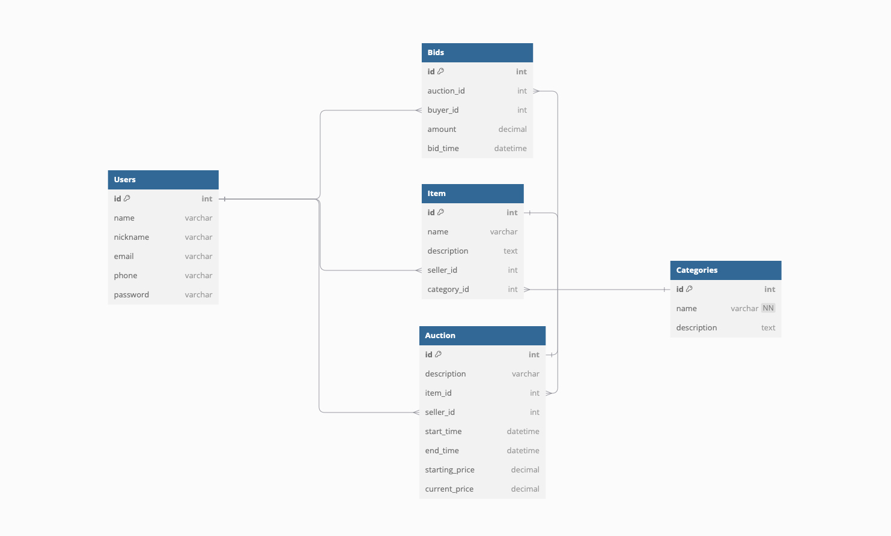

# Server

## Requirements:
- Design and implement at least 5 resources. You can design and implement more resources if you want. You can even not implement all the resources you have in your design (minimum is 5).
-	Each HTTP method (GET,PUT/PATCH, POST and DELETE) must be used at least twice in the uniform interface (PATCH is not mandatory). This does not mean that all the methods GET/PUT/POST/DELETE must be used in one single resource.

1. Users
- GET /users List users
- GET /users/id Get specific user
- POST /users Create new user
- PUT /users/id Update user details
- DELETE /users/id Delete user

2. Items
- GET /items List items
- GET /items/id Get specific item
- POST /items Add new item
- PUT /items/id Update item details
- DELETE /items/id Delete item

3. Auctions
- GET /auctions List auctions
- GET /auctions/id Get specific auction
- POST /auctions Create new auction
- DELETE /auctions/id Delete auction

4. Bids
- GET /bids List bids
- GET /bids/id Get specific bid
- POST /bids Place new bid
- PUT /bids/id Update bid details
- DELETE /bids/id Delete bid

5. Categories
- GET /categories List categories
- POST /categories Add new category

# Client
The client interacts with the RESTful API and utilizes at least 3 resources (Users, Items, and Categories)

## Client Action List
1. Fetch Users (GET /users)
- Retrieve a list of all users and display their IDs and names
2. Fetch Items (GET /items)
- Retrieve a list of all items and display their names, descriptions, and associated category IDs
3. Fetch Categories (GET /categories)
- Retrieve a list of all categories and display their names and descriptions
4. Create a New User (POST /users)
- Add a new user by providing their name, email, and other details
5. Create a New Item (POST /items)
- Add a new item under a specific category and associate it with a seller (user)
6. Update a Category (PUT /categories/id)
- Update the name or description of a specific category
7. Delete an Item (DELETE /items/id)
- Remove an item from the database

Auxiliary Service idea
An independent service that monitors auctions and notifies users about auctions nearing their end

# DB draft design

Draft code is found inside db folder readme

